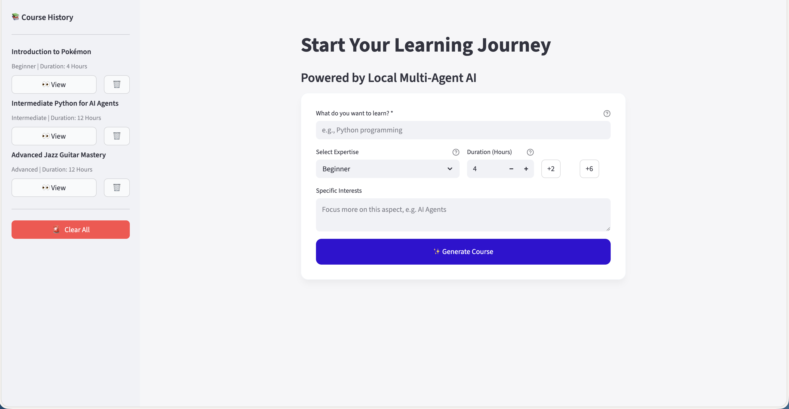
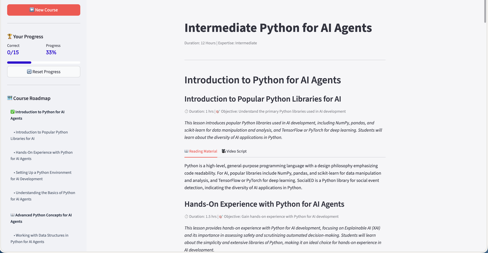
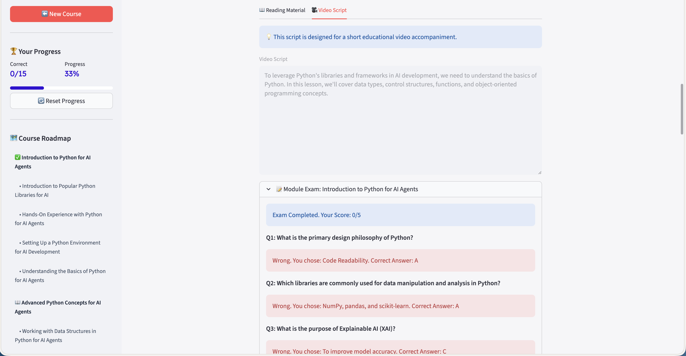
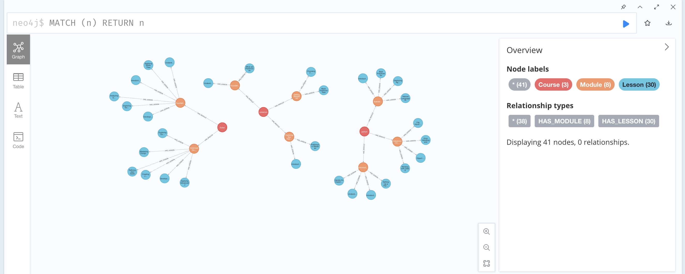

# 🎓 AI-Powered Adaptive Course Generator

An intelligent, self-hosted educational platform that deconstructs complex topics into structured, multi-modal learning paths. Powered by **LangGraph** for agentic workflows and **Neo4j** for graph-based knowledge management.

---

## 🚀 Key Updates & Features

* **Local-First AI**: Runs entirely on your machine using **Ollama (Llama 3.2)**—no API keys required.
* **Unified Proxy**: Uses **LiteLLM** to provide an OpenAI-compatible interface for local models.
* **Semantic Discovery**: Checks Neo4j before generation to find existing courses, saving time and compute.
* **Agentic Workflow**: A four-agent system (Discovery, Deconstructor, Librarian, Professor).
* **Graph-Based Storage**: Lessons and modules mapped as nodes for complex relationship tracking.
* **Interactive Roadmap**: Real-time progress tracking, scoring, and smooth-scrolling navigation.

---

## 📸 Interface Gallery


| 🏗️ Homepage | 📖 Course Content |
| :---: | :---: |
|  |  |
| *Easy inputs, not putting the user to prompt.* | *Course with easy navigation from the sidebar* |

| Video Script & Quizes | 🕸️ Knowledge Graph |
| :---: | :---: |
|  |  |
| *Interactive quizzes with string-matching logic and reset capabilities.* | *Visualizing course structure and relationships within Neo4j.* |

---

## 🛠️ Tech Stack

* **Frontend**: [Streamlit](https://streamlit.io/)
* **Orchestration**: [LangGraph](https://www.langchain.com/langgraph)
* **Local LLM**: [Ollama](https://ollama.com/) (Llama 3.2)
* **API Proxy**: [LiteLLM](https://github.com/BerriAI/litellm)
* **Database**: [Neo4j](https://neo4j.com/)
* **Package Manager**: [uv](https://github.com/astral-sh/uv) (Inside Docker)

---

## 🏗️ Agent Architecture

1. **The Discovery Agent**: Matches user intent against existing Neo4j records.
2. **The Deconstructor**: Builds the skeletal syllabus based on duration and expertise.
3. **The Librarian**: Conducts deep-dive research via DuckDuckGo and Wikipedia.
4. **The Professor**: Synthesizes research into pedagogical content and assessments.

---

## 🚦 Getting Started (Dockerized)

### 1. Prerequisites

* [Docker Desktop](https://www.docker.com/products/docker-desktop/) installed.
* Assign at least **8GB of RAM** to Docker in *Settings > Resources*.

### 2. Setup & Run

```bash
git clone <your-repo-url>
cd ai-course-generator
# Edit your .env as shown below
docker compose -f docker/docker-compose.yml up --build

```

### 3. Environment Setup (`.env`)

```env
AI_ENDPOINT=http://litellm:4000/v1
AI_MODEL=ollama/llama3.2
NEO4J_URI=bolt://neo4j-db:7687
NEO4J_USERNAME=neo4j
NEO4J_PASSWORD=P@ssword1234

```

---

## 📂 Project Structure

```text
.
├── docker/                 # Docker Compose & LiteLLM configs
├── screenshots/            # UI Gallery images
├── src/
│   ├── agents/             # Discovery, Librarian, Professor logic
│   ├── database/           # Neo4j operations
│   ├── graph/              # LangGraph workflow definition
│   ├── ui/                 # Streamlit sidebars and views
│   └── main.py             # App entry point
└── Dockerfile              # uv-optimized build

```

